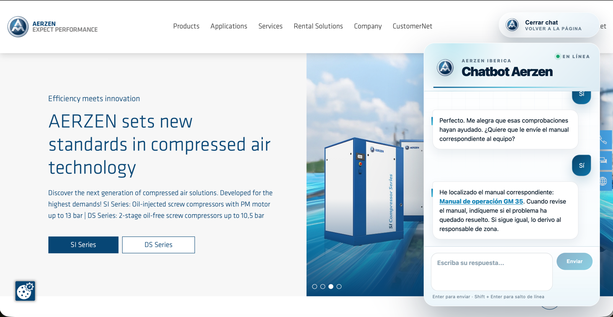
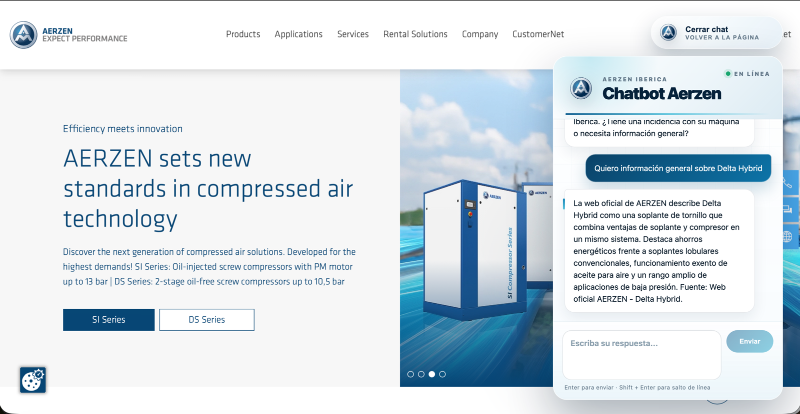

# AERZEN Iberica After-Sales Chatbot

An embeddable chat widget and a Fastify backend that handle after-sales conversations for industrial
blowers and compressors. The assistant validates serial numbers, checks warranty state, routes the case
to the right area manager and hands over the machine manual.

Operational facts always come from PostgreSQL. The language model is an optional layer on top that
rephrases answers — it is never allowed to decide or invent them.

<p>
  
  <br />
  
  <br />
  
  <br />
  
  <br />
  
  <br />
  
  <br />
  
</p>



## Highlights

- **Operational facts stay deterministic.** Serial validation, warranty state, region lookup and area
  manager assignment are read from PostgreSQL through typed tools, so the answers cannot drift.
- **Replies are guarded before they reach the customer.** Every rephrased reply is compared with the
  deterministic one and discarded if it drops a protected term: an incident reference, a URL, a
  serial number, a worker name or a warranty statement.
- **Answers cite their sources.** Retrieval-based replies name the document they came from, and
  manual links render as real links inside the widget.
- **It runs with no API key at all.** Without `GROQ_API_KEY` the entire conversation is served by a
  deterministic engine: same flow, no network call, no model dependency.
- **A 17-state conversation flow** with rotating prompt variants per state and one main question per
  turn, from greeting to satisfaction rating.
- **Embeddable with one script tag.** The widget ships as a UMD bundle and its CSS is scoped to the
  widget itself, so it does not restyle the page that hosts it.
- **A bounded, abuse-resistant API.** Per-IP rate limiting, request timeouts on every outbound call,
  zod-validated payloads and manual downloads confined to a single directory.
- **60 unit tests plus scripted end-to-end conversations** covering the flow engine, the retrieval
  layer, the operational tools, the rate limiter and the widget's rendering helpers.
- **Synthetic demo data you can reset.** The seed loads a fully fictional customer set, and refuses to
  wipe a non-local database unless it is explicitly authorised.

## Project structure

```text
apps/
  backend/          Fastify API, state machine, operational tools and retrieval
    src/flow/       engine.ts (orchestration) and definition.ts (states and prompts)
    src/ai/         conversational providers: Groq, plus the deterministic fallback
    src/services/   session persistence, Telegram delivery, vector knowledge base
    src/vector/     VectorStore interface and the in-memory implementation
  widget/           React 19 widget, demo page and the UMD embed entry point
packages/
  shared/           shared TypeScript types
prisma/
  schema.prisma     regions, workers, customers, machines, data sheets, manuals, incidents, sessions
  seed.ts           synthetic demo data
scripts/            manual and web importers, question bank and conversation test runners
docs/               screenshots used by this README
```

## Quick start

You need Node.js 20 or newer and Docker, with ports `3001` (API) and `5173` (widget) free.

```bash
git clone https://github.com/SergioLorenteDev/aerzenChatbot.git && cd aerzenChatbot
npm install && cp .env.example .env
docker compose up -d
npx prisma db push --schema prisma/schema.prisma && npm run prisma:seed
npm run dev
```

- API: <http://localhost:3001> — health check at <http://localhost:3001/api/health>
- Widget demo page: <http://localhost:5173>

`npm run dev` starts both workspaces together. The seed loads the demo data described below, and
`GROQ_API_KEY` is optional: leave it empty in `.env` and the deterministic engine takes over.

## Configuration

Every variable is read and validated in `apps/backend/src/config/env.ts`. Copy `.env.example` to
`.env` and fill in what you need.

| Variable | Default | Notes |
| --- | --- | --- |
| `DATABASE_URL` | local Postgres on port `55432` | Connection string used by Prisma. |
| `PORT` | `3001` | API port. |
| `PUBLIC_API_BASE_URL` | `http://localhost:${PORT}` | Public base URL used to build absolute manual links sent to customers. Set it in any real deployment. |
| `CORS_ALLOWED_ORIGINS` | *empty* | Comma-separated list of allowed origins. Empty reflects the request origin, which is what an embedded widget needs. |
| `RATE_LIMIT_WINDOW_MS` | `60000` | Length of the rate-limit window. |
| `RATE_LIMIT_MAX_REQUESTS` | `30` | Requests per IP and window on the chat routes. |
| `VECTOR_PROVIDER` | `memory` | Retrieval index provider. `memory` builds the index in process from the authorized document table and refreshes it as documents change. |
| `VECTOR_CACHE_TTL_MS` | `30000` | How often the knowledge base re-checks the document table for changes. |
| `MANUALS_DIR` | `fixtures/content/pdfs` | Directory the manual importer reads and the download route is allowed to serve from. |
| `GROQ_API_KEY` | *empty* | Enables the conversational layer. Without it the deterministic engine is used. |
| `GROQ_MODEL` | `openai/gpt-oss-20b` | Model name sent to the Groq responses API. |
| `GROQ_BASE_URL` | `https://api.groq.com/openai/v1` | Base URL of the API. |
| `GROQ_TIMEOUT_MS` | `20000` | Per-request timeout. |
| `TELEGRAM_BOT_TOKEN` | *empty* | Enables Telegram notifications when an incident is created. |
| `TELEGRAM_DEFAULT_CHAT_ID` / `TELEGRAM_DEFAULT_CHAT_IDS` | *empty* | Fallback recipients, the second one comma-separated. |
| `TELEGRAM_TIMEOUT_MS` | `10000` | Per-request timeout. |
| `CHATBOT_TRACE_AI` | `false` | Adds an AI trace (base versus final reply) to chat responses for debugging. |
| `VITE_API_BASE_URL` | `http://localhost:3001` | Backend the widget talks to. Inlined at build time, so set it before building the widget. |

## HTTP API

| Method | Path | Notes |
| --- | --- | --- |
| `POST` | `/api/chat/start` | Opens a session and returns its `sessionId` plus the greeting. |
| `POST` | `/api/chat/message` | Body `{ sessionId, message }`. Returns the next state and the assistant reply. `400` on an invalid payload, `404` on an unknown session, `429` when rate limited. |
| `GET` | `/api/manuals` | Lists the registered manuals. |
| `GET` | `/api/manuals/:id/file` | Streams the manual PDF, redirects when it is an external URL, and returns `404` for anything outside `MANUALS_DIR`. |
| `GET` | `/api/health` | Verifies the database connection. |

## The conversation flow

The engine is a state machine, so the assistant always knows what it is waiting for:

```text
greeting → intent (incident | general information)
  incident:  model → serial availability → serial validation → location
             → issue description → guidance → resolution check
             → area manager offer → incident created → manual offer
             → anything else → rating → closing
  information: documented answer with sources → anything else → rating → closing
```

Facts are resolved along the way: an unknown serial is retried twice and then the case is routed by
region, and the customer always sees whether the machine is under warranty.

## The embeddable widget

Build the bundle, then load the stylesheet and the UMD script on any page:

```bash
VITE_API_BASE_URL=https://api.example.com npm run build --workspace @aerzen/widget
```

```html
<link rel="stylesheet" href="/widget/aerzen-chatbot-widget.css" />
<div id="aerzen-chatbot"></div>
<script src="/widget/aerzen-chatbot-widget.umd.js"></script>
<script>
  window.AerzenChatbot.mount("#aerzen-chatbot", {
    apiBaseUrl: "https://api.example.com",
    title: "Asistente de postventa"
  });
</script>
```

`mount()` is idempotent, and `window.AerzenChatbot.unmount("#aerzen-chatbot")` releases the React tree.
The stylesheet only targets `.aerzen-widget-shell` and its children, so the host page keeps its own
typography, margins and background.

## Grounded answers

General questions are answered from the authorized document table: the assistant scores the candidate
documents, answers from the best match and names the source in the reply, so the customer can see where
the information comes from.



## Optional AI layer

When `GROQ_API_KEY` is set, the model is used for three narrow jobs and nothing else:

1. **Turn analysis** — intent, greeting, yes/no and entity candidates, returned as a strict JSON schema.
2. **Reply humanisation** — rewriting the deterministic reply; the result is rejected if it drops a
   protected term.
3. **Document-grounded answers** — summarising retrieved documents, instructed to use only the sources
   it is given.

Everything operational stays in TypeScript: the model never decides warranty, serial validity, region,
assigned worker, incident creation or technical facts.

## Demo data

`npm run prisma:seed` loads fictional data so the flow can be exercised end to end. Region to area
manager: Andalucia, Extremadura y Canarias → Ana Ferrer; Centro y Castilla La Mancha → Luis Cano;
Levante, Cataluña, Pais Vasco → Marta Rios.

| Model | Serial | Warranty ends | Customer |
| --- | --- | --- | --- |
| GM 35 | `GM35-ES-0001` | 2027-03-15 | Oleica Andaluza S.L. |
| Delta Hybrid D52 | `DH52-ES-1044` | 2023-06-20 | Quimica Manchega S.L. |
| VMX 160 | `VMX160-ES-7788` | 2026-09-02 | Papelera Cantabra S.L. |
| PI1.5 AWK CL FDA GJL R Z | `9000001`, `9000002`, `9000003` | — | Planta Demo Industrial S.L. (Ciudad Demo) |

Start a conversation, choose *incident*, type `GM 35` and then `GM35-ES-0001` to walk the happy path.
The seed refuses to wipe a non-local database unless it is run with `SEED_ALLOW_WIPE=1`.

## Maintenance scripts

| Script | What it does |
| --- | --- |
| `npm run import:manual-docs` | Reads the manual PDFs in `MANUALS_DIR` and indexes their text and anomaly tables. |
| `npm run import:web-docs` | Crawls the authorized product pages and stores them as retrievable chunks. |
| `npm run generate:web-question-bank` | Generates a question bank from the imported web documents. |
| `npm run test:chatbot` | Runs three scripted conversations against a running API and asserts the states. |
| `npm run test:chatbot:bulk` | Runs randomized conversations and writes a report under `reports/`. |
| `npm run trace:chatbot:ai` | Records the deterministic reply next to the humanised one for comparison. |

The runners expect the seeded demo data and a running API, and they back off automatically when the API
returns `429`. The importers need `MANUALS_DIR` pointing at your PDFs, and `import:web-docs` pauses
between requests so it does not hammer the source site. Reports are written to `reports/`, which is
git-ignored.

## Deployment

```bash
npm run build
npx prisma db push --schema prisma/schema.prisma
node apps/backend/dist/server.js
```

1. Serve the widget's `dist/` folder as static assets from your site.
2. Set `PUBLIC_API_BASE_URL` to the API's public URL, and `CORS_ALLOWED_ORIGINS` to the sites allowed
   to embed the widget.
3. Set `DATABASE_URL` to the production database and `MANUALS_DIR` to the folder holding the manuals.
4. Run the API behind your reverse proxy of choice; the process listens on `PORT`.
5. The rate limiter keeps its windows in memory, so run a single API instance or move the limiter to a
   shared store before scaling out horizontally.

## Roadmap

- [ ] Versioned Prisma migrations committed to the repository, for repeatable deployments.
- [ ] A PostgreSQL-backed vector store behind the existing `VectorStore` interface, so the knowledge
      base scales past a single process.
- [ ] Real e-mail delivery for the handoff summary.
- [ ] Component tests for the widget in a DOM environment, on top of the current pure-logic tests.
- [ ] A one-command bootstrap that provisions, migrates and seeds the database for a new checkout.
- [ ] An admin endpoint to manage manuals and authorized documents without touching the database.

## Conventions

- Commits follow [Conventional Commits](https://www.conventionalcommits.org/) in English, with an
  imperative subject of 50 characters or fewer.
- `npm test` runs the unit suite, `npm run typecheck` type-checks every workspace and `npm run build`
  compiles them in dependency order. These three are the checks to run before pushing.
- New tables and columns go into `prisma/schema.prisma`; `npm run prisma:migrate` creates the migration.
- Product copy and inline comments are written in Spanish; identifiers, scripts and this document are
  in English.

## License

Released under the [MIT License](LICENSE). Copyright (c) 2026 Sergio Lorente Bogas.
